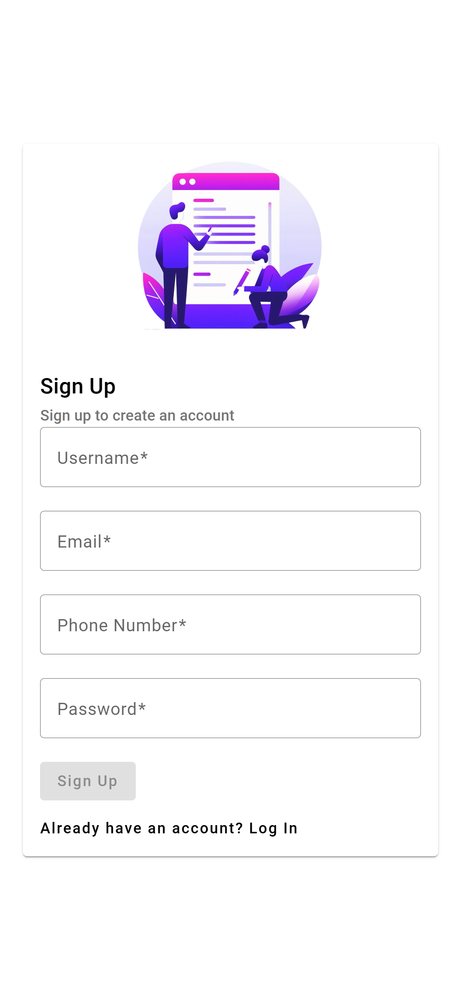
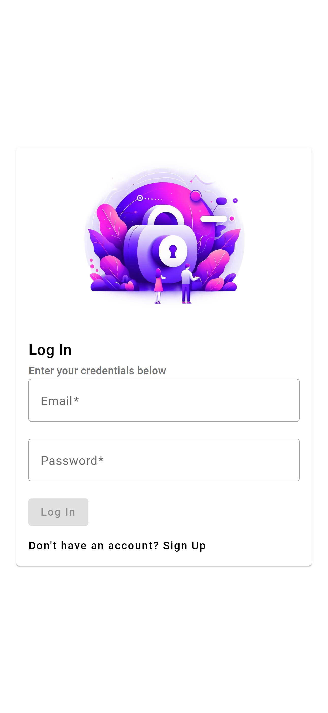
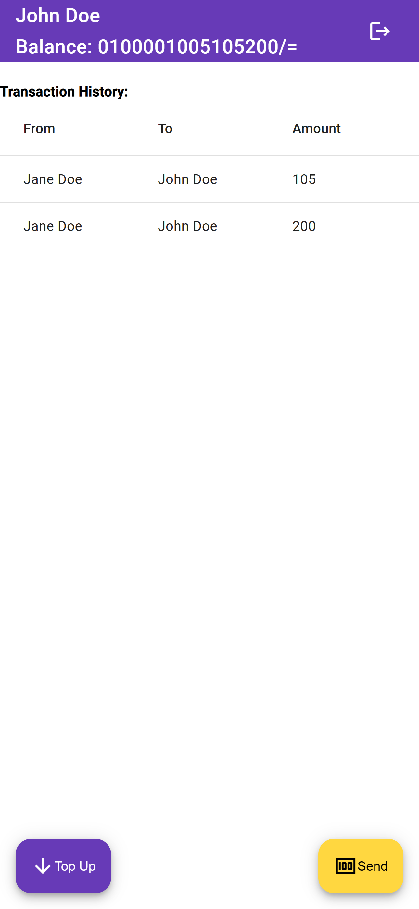
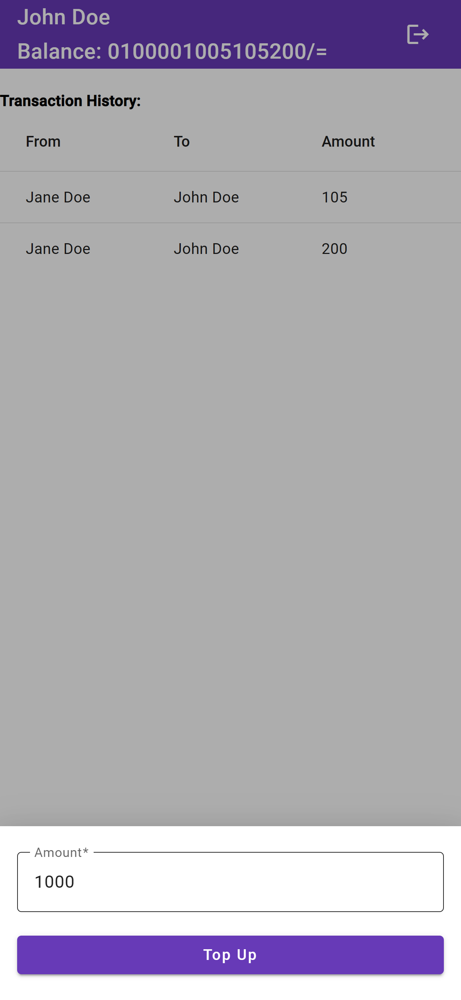
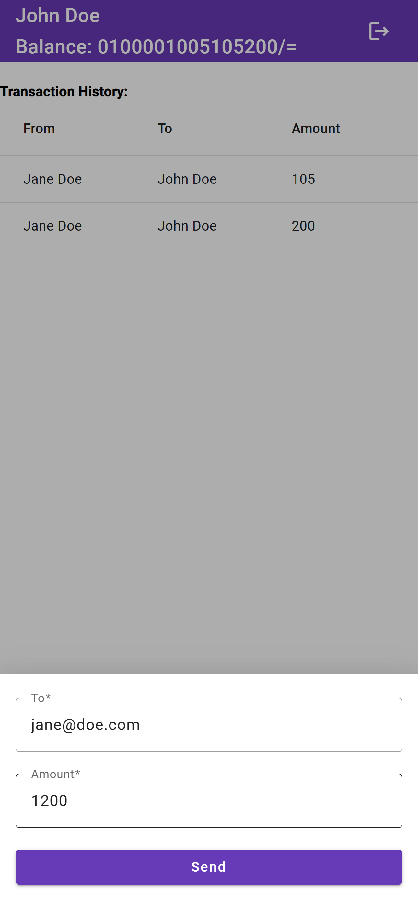
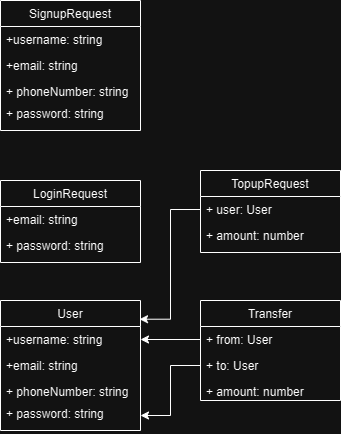

# Moola

A financial application that allows users to top up and transfer money between users.

## Pages and Functionalities

### Sign Up

The **Sign Up** page allows new users to create an account. After successful registration, users are redirected to the login page. 

### Log In

The **Log In** page allows users to access their account by entering their email and password. Upon successful login, users are redirected to the dashboard. 

### Dashboard

The **Dashboard** page displays the current user's username and balance on the toolbar. It also shows a table of the user's transaction history, including the sender, receiver, and amount of each transaction. 

There are two Floating Action Buttons (FABs) on the Dashboard page:

1. **Top Up**: Opens a bottom sheet with a form for users to top up their account balance.
2. **Transfer**: Opens a bottom sheet with a form for users to transfer money to other users. The form includes an autocomplete field for the receiver's email or phone number.

### Top Up

The **Top Up** form allows users to top up their account balance. 

### Transfer

The **Transfer** form in the bottom sheet allows users to transfer money to other users either via their emails or phone numbers. 

## Technical Tools Used

- **Angular**: A platform for building web applications.
- **Angular Material**: A UI component library for Angular.
- **Firebase**: A backend-as-a-service (BAAS) service.

## Database Models

## Live Demo

A live demo of the application is available at [https://moola-1.web.app/](https://moola-d6b51.web.app/).

## Build

Run `ng build` to build the project. The build artifacts will be stored in the `dist/` directory.

## Running unit tests

Run `ng test` to execute the unit tests via [Karma](https://karma-runner.github.io).

## Running end-to-end tests

Run `ng e2e` to execute the end-to-end tests via a platform of your choice. To use this command, you need to first add a package that implements end-to-end testing capabilities.

## Further help

To get more help on the Angular CLI use `ng help` or go check out the [Angular CLI Overview and Command Reference](https://angular.io/cli) page.
